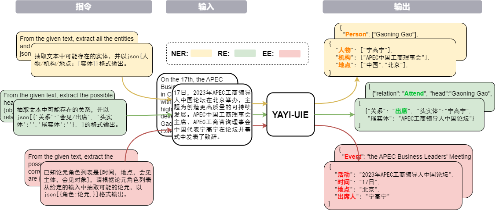
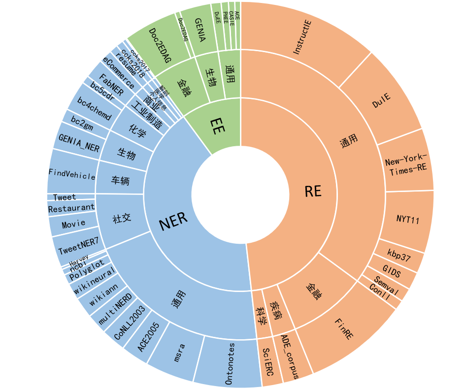
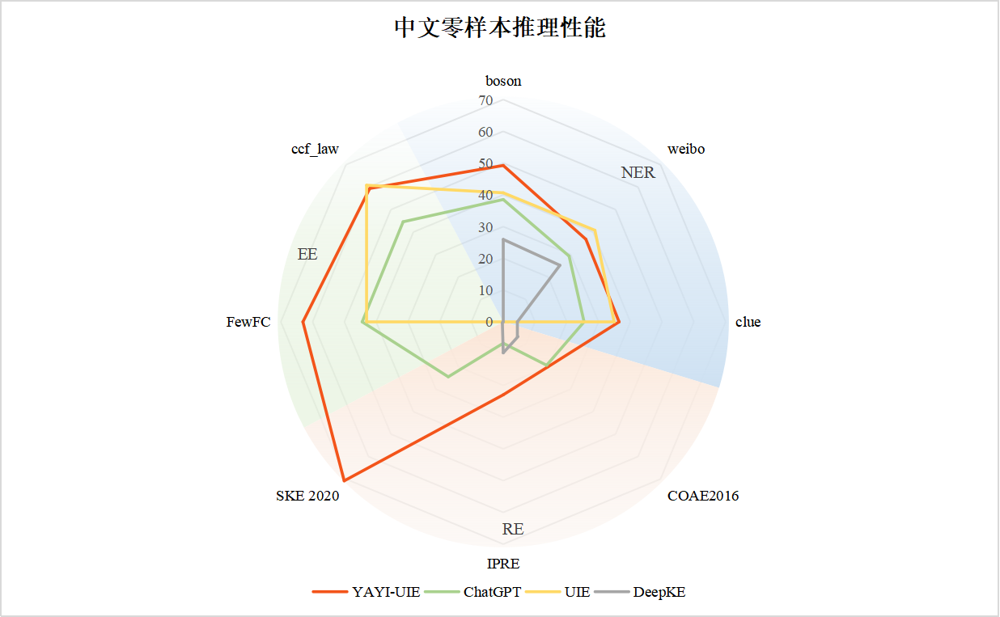

# YAYI UIE

<div align="center">

<br>

[](./LICENSE)

[[📖README](./README_EN.md)] 
[[🤗HF Repo](https://huggingface.co/wenge-research)]
[[🔗URL](https://yayi.wenge.com)]

</div>


## Introduction
The YAYI Unified Information Extraction Large Language Model (YAYI-UIE), fine-tuned on millions of high-quality data, integrates training across tasks such as Named Entity 
Recognition (NER), Relation Extraction (RE), and Event Extraction (EE). The model is able to extract structured outputs across diverse fields including general, security, 
finance, biology, medicine, business, personal, automotive, film, industry, restaurant, and science.

The open-source of YAYI-UIE aims to foster the growth of the Chinese PLM open-source community. We can't wait to collaborate with our partners to develop the YAYI Large Models ecosystem!



## Model links
| Model Name | 🤗HF |  Download Links  |
| --------- | ---------    | --------- |
|  YAYI-UIE  | wenge-research/yayi-uie  | [YAYI-UIE](https://huggingface.co/wenge-research/YAYI-UIE)  |


## Training Datasets
In the corpus of over a million entries, 54% are in Chinese and 46% in English. The dataset encompasses 12 fields including finance, society, biology, business, industrial manufacturing, chemistry, vehicles, science, disease and medicine, personal life, security, and general topics, covering hundreds of scenarios:

- NER: In Chinese, it covers **28** types of entities including individuals, geopolitics, organizations, body parts, drugs, etc., while in English, it covers 130 types of entities such as Animals, Weapons, Conferences, Books, etc.
- RE: In Chinese, it includes **232** types of relations like acquisitions, stake increases, restructurings, nationality, aliases, relatives, buying shares, transfers, causes, locations of occurrence, manufacturers, etc., and in English, 236 types of relations such as founded by, state or province of headquarters, employee of, occupation, creator, etc.
- EE: Chinese covers **84** types of events including winning a bid, executive changes, product actions - launches, company listings, etc., and **203** types of arguments, whereas English covers **45** types of events such as Birth, Demonstration, Meeting, End of Organization, Divorce, etc., and **62** types of arguments.





## Quick Start
#### Set up conda envs
1. clone the repos

```bash
git clone https://github.com/wenge-research/yayi-uie.git
cd yayi-uie
```

2. create conda envs

```bash
conda create --name uie python=3.8
conda activate uie
```

3. set up envs

```bash
pip install -r requirements.txt
```

#### Inference
We've alredy open-sourced our model weights on [Huggingface](https://huggingface.co/wenge-research). 
The following is a code snippet for using YAYI-UIE for downstream task inference. It can run on a single A100/A800 GPU, and it occupies approximately 33GB of GPU memory when using bf16 precision for inference.
```python
import torch
from transformers import AutoModelForCausalLM, AutoTokenizer
from transformers.generation.utils import GenerationConfig
tokenizer = AutoTokenizer.from_pretrained("wenge-research/yayi-uie", use_fast=False, trust_remote_code=True)
model = AutoModelForCausalLM.from_pretrained("wenge-research/yayi-uie", device_map="auto", torch_dtype=torch.bfloat16, trust_remote_code=True)
generation_config = GenerationConfig.from_pretrained("wenge-research/yayi-uie")
prompt = "Text: Alberto Mancini won in the final 7–5 , 2–6 , 7–6 , 7–5 against Boris Becker . \nFrom the given text, extract all the entities and types. Please format the answer in json {location/person/organization：[entities]}."
# "<reserved_13>" is a reserved token for human, "<reserved_14>" is a reserved token for assistant
prompt = "<reserved_13>" + prompt + "<reserved_14>"
inputs = tokenizer(prompt, return_tensors="pt").to(model.device)
response = model.generate(**inputs, max_new_tokens=512, temperature=0)
print(tokenizer.decode(response[0],skip_special_tokens=True))
```

#### Sample Prompts
Note:
- 【】is optional in prompts that indicates which task you want the model to perform
- Add specific labels in prompts to help the model generate more comprehensive information. For example, use "meeting location" instead of "location"
- Text first and then instruction yields better results.
1. NER
```
Text:
From the given text, extract all the entities and types. Please format the answer in json {person/organization/location：[entities]}.
```
2. RE
```
Text:
From the given text, extract the possible head entities (subjects) and tail entities (objects) and give the corresponding relation triples.The relations are [country of administrative divisions,place of birth,location contains]. Output the result in json[{'relation':'', 'head':'', 'tail':''}, ].
```
3. EE
```
Text:
Given the text and the role list [seller, place, beneficiary, buyer], identify event arguments and roles, provide your answer in the format of json{role:name}.
```

## Zero-shot Evaluation
1. NER tasks

AI，Literature,Music,Politics and Science are English datasets; boson，clue and weibo are Chinese datasets

| Model | AI | Literature | Music | Politics | Science | EN Average | boson | clue | weibo | ZH Average |
| ------ | ------ | ------ | ------ | ------ | ------ | ------ | ------ | ------ | ------ | ------ |
| davinci | 2.97 | 9.87 | 13.83 | 18.42 | 10.04 | 11.03 | - | - | - | 31.09 |
| ChatGPT 3.5 | **54.4** | **54.07** | **61.24** | **59.12** | **63** | **58.37** | 38.53 | 25.44 | 29.3 |
| UIE | 31.14 | 38.97 | 33.91 | 46.28 | 41.56 | 38.37 | 40.64 | 34.91 | 40.79 | 38.78 |
| USM | 28.18 | 56 | 44.93| 36.1 | 44.09 | 41.86 | - | - | - | - |
| InstructUIE |	49 | 47.21 | 53.16 | 48.15 | 49.3 | 49.36 | - | - | - | - |
| DeepKE-LLM | 13.76 | 20.18 | 14.78 | 33.86 | 9.19 | 18.35 | 25.96 | 4.44 | 25.2 | 18.53 |
| YAYI-UIE | 52.4 | 45.99 | 51.2	| 51.82 | 50.53 | 50.39 | **49.25** | **36.46** | 36.78 | **40.83** |

2. RE Tasks

FewRe and Wiki-ZSL are English datasets; SKE 2020, COAE2016 and IPRE are Chinese datasets

| Model | FewRe | Wiki-ZSL | EN Average | SKE 2020 | COAE2016 | IPRE | ZH Average |
| ------ | ------ | ------ | ------ | ------ | ------ | ------ | ------ |
| ChatGPT 3.5 | 9.96 | 13.14 | 11.55  24.47 | 19.31 | 6.73 | 16.84 |
| ZETT(T5-small) | 30.53 | 31.74 | 31.14 | - | - | - | - |
| ZETT(T5-base) | 33.71 | 31.17 | 32.44 | - | - | - | - |
| InstructUIE |**39.55** | 35.2 | 37.38 | - | - | - | - |
| DeepKE-LLM | 17.46 | 15.33 | 16.40 | 0.4 | 6.56 | 9.75 |5.57|
| YAYI-UIE | 36.09 | **41.07** | **38.58** | **70.8** | **19.97** | **22.97**| **37.91**|

3. EE Tasks

commodity news is a English dataset, FewFC and ccf_law are Chinese datasets


EET（Event Type Extraction）

| Model | commodity news | FewFC | ccf_law | ZH Average |
| ------ | ------ | ------ | ------ | ------ |
| ChatGPT 3.5 | 1.41 | 16.15 | 0 | 8.08 |
| UIE | - | 50.23 | 2.16 | 26.20 |
|InstructUIE| **23.26** | - | - | - |
| YAYI-UIE | 12.45 | **81.28** | **12.87** | **47.08**|

EEA（Event Arguments Extraction）

| Model | commodity news | FewFC | ccf_law | ZH Average |
| ------ | ------ | ------ | ------ | ------ |
| ChatGPT 3.5 | 8.6 | 44.4 | 44.57 | 44.49 |
| UIE | - | 43.02 | **60.85** | 51.94 |
|InstructUIE| **21.78** | - | - | - |
| YAYI-UIE | 19.74 | **63.06** | 59.42 | **61.24** |




## Terms and Conditions
#### Limitations

The SFT model, trained using the data and the base model, still faces the following issues:

1. The information extracted may lead to factually incorrect answers.
2. It struggles to effectively discern harmful instructions, potentially resulting in hazardous statements.
3. The model's extraction capability needs improvement in scenarios involving paragraph-level texts.

#### Disclaimer
Given the limitations of the model outlined above,we require developers to use the code, data, models, and any derivatives generated from this project solely for research 
purposes. They must not be used for commercial purposes or other applications that could harm society. Users should be careful in discerning and utilizing content generated 
by YAYI UIE, and avoid distributing harmful content on the internet. The spreader bears sole responsibility for any adverse consequences.

This project is intended only for research purposes. The project developers are not liable for any harm or loss resulting from the use of this project, including but not 
limited to data, models, and code. For more details, please refer to the disclaimer.

#### Open Source License
The code and data in this project is open-sourced under the [Apache-2.0](./LICENSE.txt) license. The use of YAYI-UIE model or its derivatives must adhere to [Baichuan2](https://github.com/baichuan-inc/Baichuan2)'s community and commercial Model License.

## Updates
- [2023/12/15] YAYI-UIE is released and open-sourced

## Reference 
- Databricks [dolly](https://github.com/databrickslabs/dolly) and Huggingface [transformers](https://github.com/huggingface/transformers) ；
- Distributed training use Microsoft [DeepSpeed](https://github.com/microsoft/deepspeed) and configs from [ZeRO stage 2](https://huggingface.co/docs/transformers/main_classes/deepspeed#zero2-config) ；
- We sincerely appreciate the support provided by the following open-source projects.:[InstructUIE](https://github.com/BeyonderXX/InstructUIE/tree/master); [Baichuan2-Base](https://github.com/baichuan-inc/Baichuan2); [InstructIE](https://github.com/zjunlp/DeepKE/tree/main/example/llm/InstructKGC); [DeepKE-LLM](https://github.com/zjunlp/KnowLM/tree/main)

## Citation
If you are using the resource for your work, please cite the our paper:
```
@article{YAYI-UIE,
  author    = {Xinglin Xiao, Yijie Wang, Nan Xu, Yuqi Wang, Hanxuan Yang, Minzheng Wang, Yin Luo, Lei Wang, Wenji Mao, Dajun Zeng}},
  title     = { YAYI-UIE: A Chat-Enhanced Instruction Tuning Framework for Universal Information Extraction},
  journal   = {arXiv preprint arXiv},
  year      = {2023}
}
```
